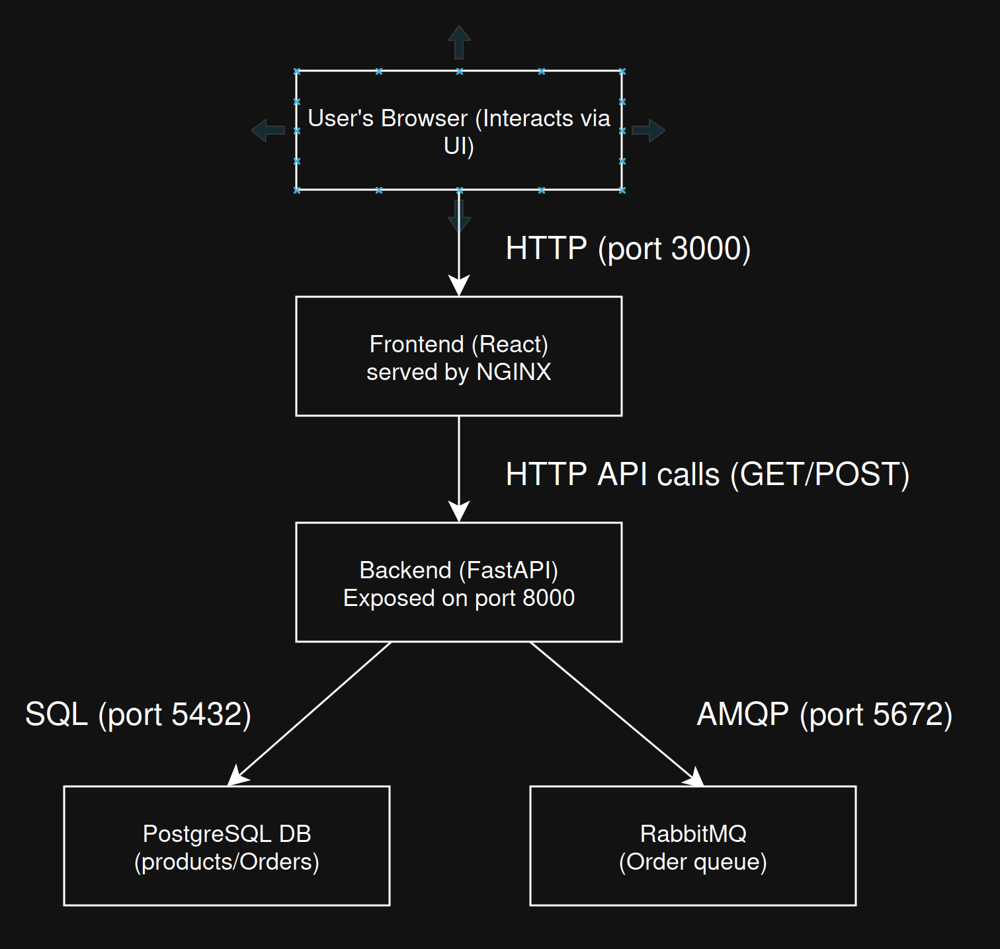

# 🥐 Bakery System

A Docker-based microservices application for managing bakery products and orders, featuring:

- **PostgreSQL** for data persistence  
- **FastAPI** backend with 3 core endpoints  
- **RabbitMQ** message queue for order events  
- **React** frontend (plain CSS)  
- **Docker Compose** for orchestration  
- Health checks, resource limits, and CORS configuration  

---

## 📐 Architecture




> **Services:**  
> 1. `db` (PostgreSQL)  
> 2. `backend` (FastAPI + SQLAlchemy)  
> 3. `rabbitmq` (AMQP + Management UI)  
> 4. `frontend` (React + Nginx)  

All services communicate over a user-defined Docker bridge network. Orders placed via the API are published to RabbitMQ for eventual processing.

---

## 🚀 Quickstart

1. **Clone & configure**  
   ```bash
   git clone git@github.com:<your-username>/bakery-system.git
   cd bakery-system
   cp backend/.env.example backend/.env
   cp frontend/.env.example frontend/.env


   